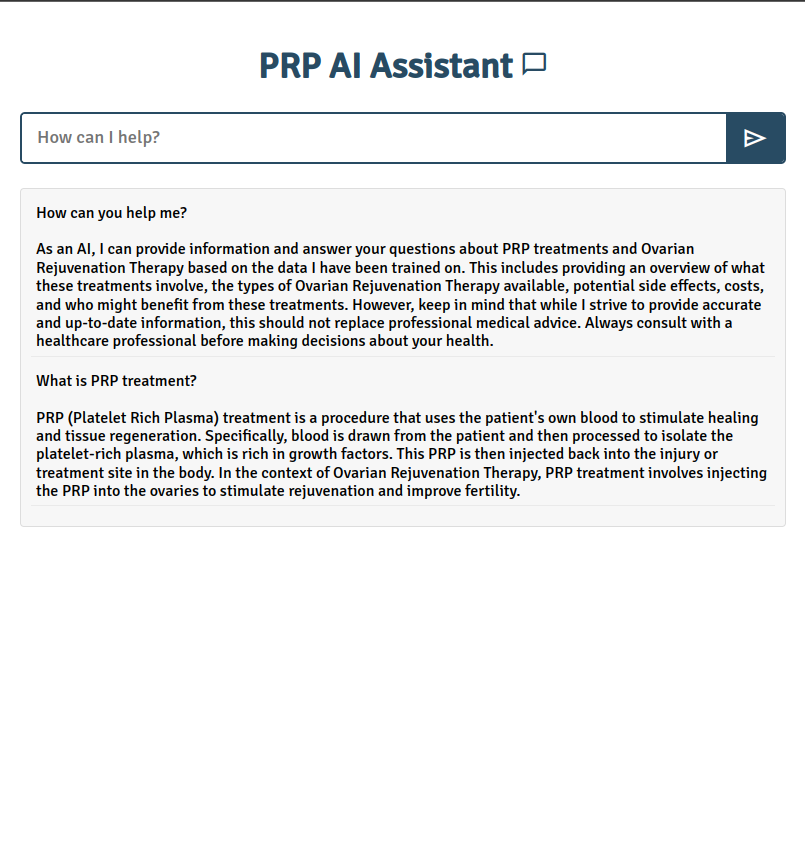

# PRP AI Assistant

The PRP AI Assistant designed to provide information and answer questions related to PRP (Platelet-Rich Plasma) treatment.
It utilizes the OpenAI API to generate answers based on a predefined context about PRP treatment. This API also integrates with Supabase for potential database interactions and supports CORS (Cross-Origin Resource Sharing).

## Prerequisites

Ensure you have met the following requirements:

- Node.js installed on your machine.
- An account and API key from OpenAI.
- An account and project setup on Supabase with API keys.

## Installation

To install the PRP Assistant API, follow these steps:

1. Clone the repository to your local machine.
2. Navigate to the project directory `server` install dependencies by running:

```pash
npm install
```

3. Create a `.env` file in the root of the project with the following variables:

```env
OPENAI_API_KEY=Your_OpenAI_API_Key
SUPABASE_API_KEY=Your_Supabase_Service_Role_API_Key
SUPABASE_URL=Your_Supabase_Project_URL
```

## Usage

To start the server, run:

```pash
npm start
```

## Resources

- To create a project and get the `API KEY` & `URL`
[Supabase](https://supabase.com/docs/guides/api/api-keys)

- To get `OpenAI API KEY`
[OpneAI API Documentation](https://platform.openai.com/docs/overview)

## Screenshot


